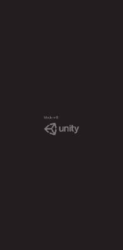

# 
Kashkaval Express (Cheese Express)

Kashkaval Express is personalized app for android, made with Unity.
  I made this for a friend, to help him organize his orders, he has a small farm that produces milk and different milk products.

 

**
The app icon is the jeep he used for the delivery.**

## 
App navigation

### 
Settings
**
Here he can change his products price**
 

### 
Clients
**
The clients list, with a button to create new client.**
 
**
It has: Name, Address, Phone, and client № (delivery order)**
 

### 
Orders
**
The orders list with a button to create new order.**
 
**
It has: Client input(opens clients list on select and fills address and phone), date picker and products.**
 

### 
Orders for today
**
The list of orders for today, sorted by delivery order.**
 
**
Clicking the order, he sees the total price to collect, has an option to call the client, and after successful delivery - cash out.**
 

#### 
The app sends reminding notifications every night if he has delivers for the next day.
#### 
Also a secret invisible button on the cow's nose, playing "Moo" sounds.

## 
DEMO

  

